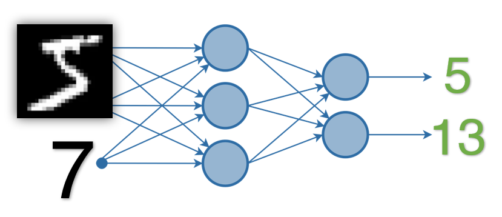

# TSAI - END3 Session 3 Assignment
*Group Members: Dhruba Adhikary, Phani Nandula, Prateek Maheshwari, Sujit Ojha*

## Problem Statement

**Write a neural network that can:**
1. take 2 inputs:  
    1. an image from the MNIST dataset (say 5), and  
    2. a random number between 0 and 9, (say 7)
2. and gives two outputs:  
    1. the "number" that was represented by the MNIST image (predict 5), and  
    2. the "sum" of this number with the random number and the input image to the network (predict 5 + 7 = 12)
    
3. you can mix fully connected layers and convolution layers  
4. you can use one-hot encoding to represent the random number input as well as the "summed" output.  
    a. Random number (7) can be represented as 0 0 0 0 0 0 0 1 0 0  
    b. Sum (13) can be represented as: 
        1. 0 0 0 0 0 0 0 0 0 0 0 0 0 1 0 0 0 0 0  
        2. 0b1101 (remember that 4 digits in binary can at max represent 15, so we may need to go for 5 digits. i.e. 10010

**Your code MUST be:**
1. well documented (via readme file on github and comments in the code)
2. must mention the data representation
3. must mention your data generation strategy (basically the class/method you are using for random number generation)
4. must mention how you have combined the two inputs (basically which layer you are combining)
5. must mention how you are evaluating your results 
6. must mention "what" results you finally got and how did you evaluate your results
7. must mention what loss function you picked and why!  
8. training MUST happen on the GPU
9. Accuracy is not really important for the SUM


**Once done, upload the code with short training logs in the readme file from colab to GitHub, and share the GitHub link (public repository)**

## Solution & Discussion
- **Two notebooks with results**

    | Methods        | Notebook           | Results: Accuracies  |
    |:----------------------------: |:---------------------:| :--------|
    | Convolutional Layers with Fully connected Layer | [Convolutional Layers + FC](Session3_Pytorch101_ver3.ipynb) |  Image  = 99% and Sum Label  = 99% |
    | Fully connected Layers only | [Fully Connected Layers](Session3_Pytorch101_ver4_2Methods.ipynb) | Image Label = 98% and Sum Label = 97% |

- **Two methods were tried in this study are**

    a. Method1: Neural Network with **Convolutional Layers & Fully Connected Layers**
     

    b. Method2: Neural Network with **Only Fully Connected Layers** ```  
    

- **Data Representation**
    


 


- ```Negative Log Likelihood Loss``` is used in the model since model is predicting a multiclass output. We calculate loss separately for each output:
Loss1 --> Loss between actual image label and predicted image label
Loss2 --> Loss between actual sum label and predicted sum label
Total Loss = Loss1 + Loss2  

- ```Cross Entropy Loss``` could also be used but we need to use ```softmax``` in the prediction layer.
- ```Binary Cross Entropy Loss``` couldnt be used here since we have more than 2 labels in each of the outputs.  
- ```Mean Squared Loss``` If used, it would converge in large number of epochs as it would penalise more the  deviation from the ground truth.


## Reference
1. https://github.com/pytorch/examples/blob/master/mnist/main.py
2. https://pytorch.org/tutorials/intermediate/tensorboard_tutorial.html
